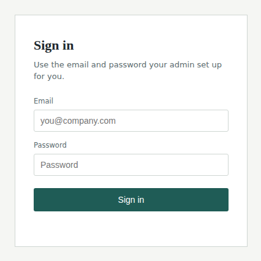
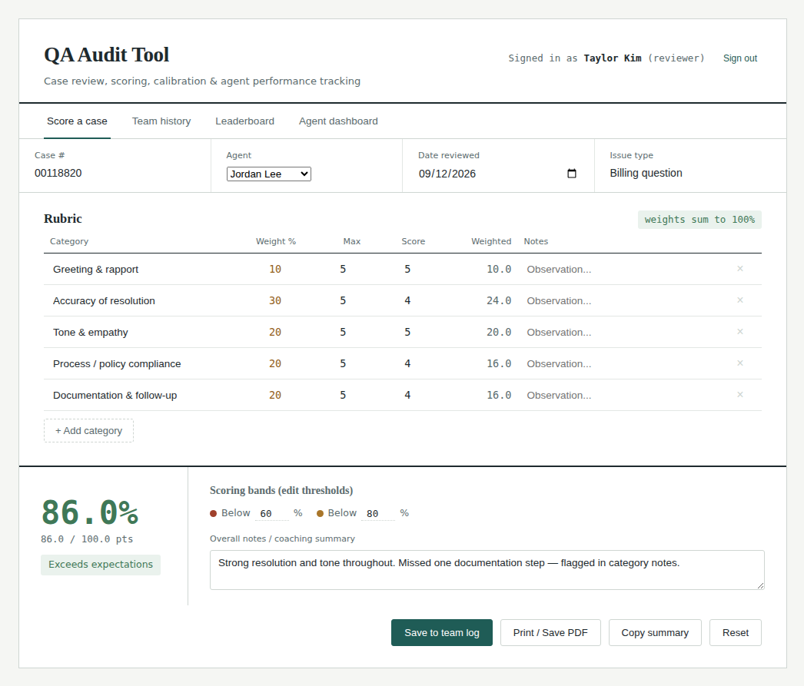
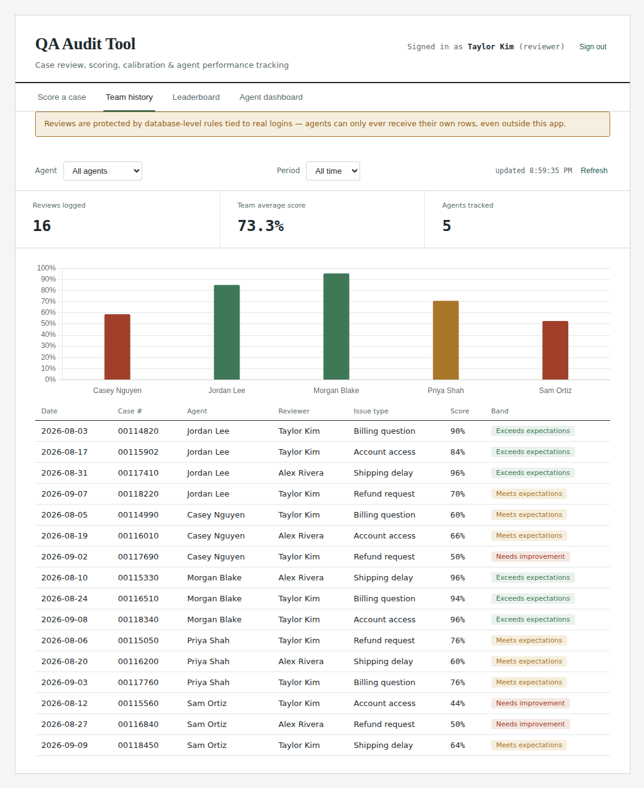
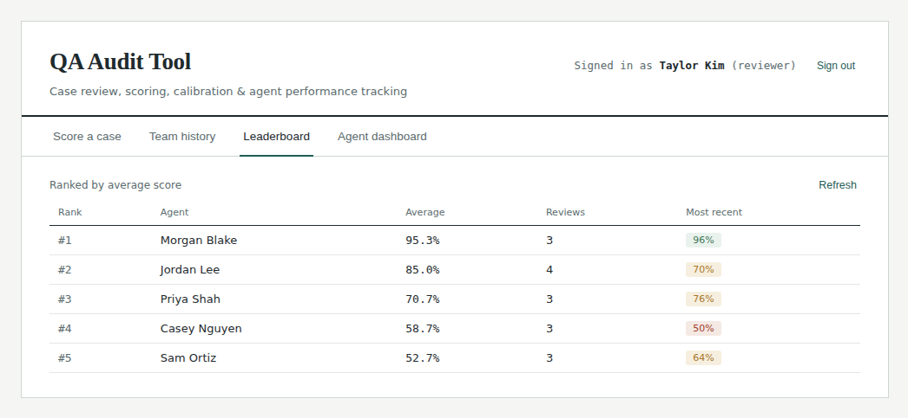
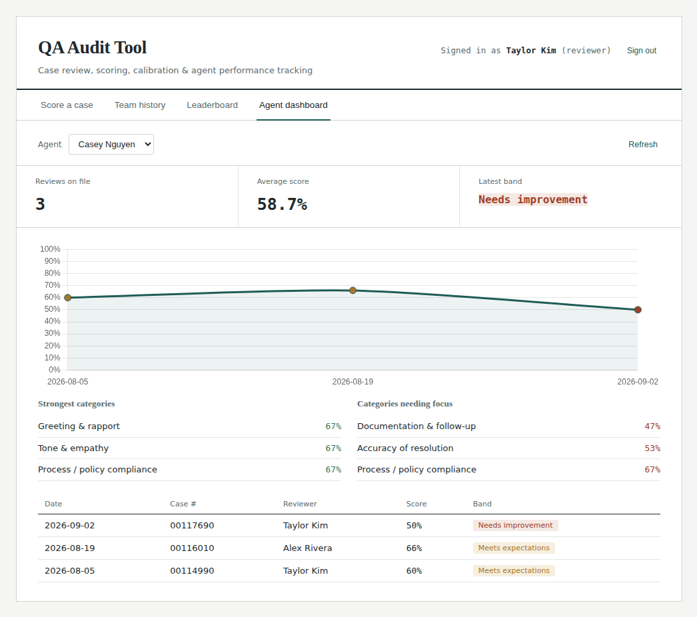
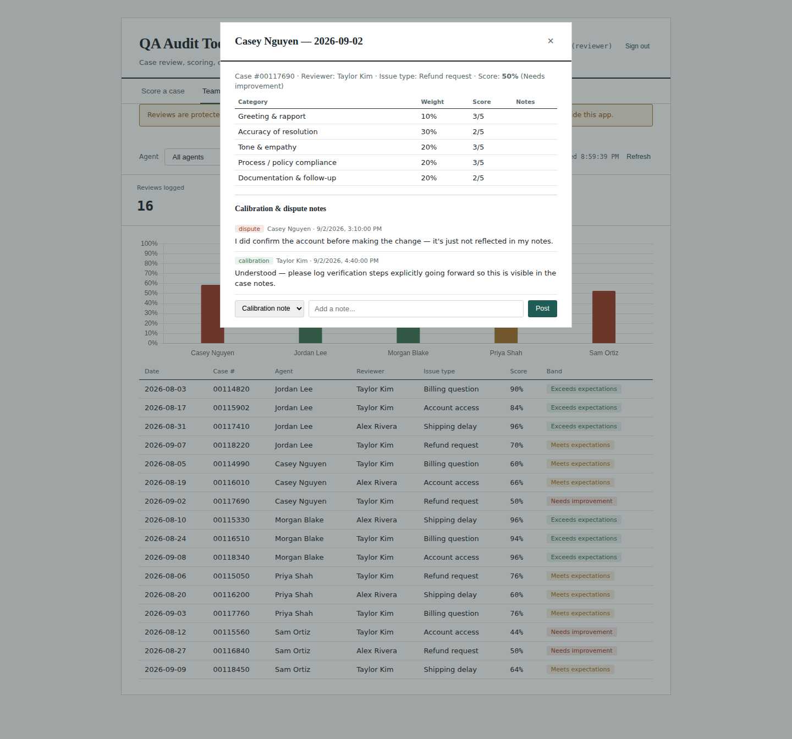

# QA Audit Tool

A quality-assurance scorecard and analytics tool for customer support teams —
built as a lightweight, self-hosted alternative to platforms like MaestroQA
and Playvox.

Reviewers score support cases against a customizable weighted rubric. Every
score rolls up into a team history log, a leaderboard, and per-agent
dashboards with trend lines and calibration/dispute threads. Access is
enforced per-person with real authentication and database-level security —
not just hidden in the UI.

## Screenshots

*(Sample data shown below — captured from a mocked build for demo purposes, no real customer data.)*

**Sign in** — one login screen; what you see next depends on your role (admin / reviewer / agent).



**Score a case** — an editable, weighted rubric with whole-number scoring, hard-capped at each category's max, and a live-calculated total and band.



**Team history** — the full review log, filterable by agent and by week or month, with a bar chart comparing agents.



**Leaderboard** — agents ranked by average score.



**Agent dashboard** — trend line over time, strongest/weakest rubric categories, and full review history for one agent.



**Calibration & dispute threads** — an agent can dispute a score on their own review; a reviewer can respond with a calibration note. Both show as a threaded log on the review.



## Features

- **Weighted rubric scoring** — editable categories, weights, and max points;
  whole-number scores only, hard-capped at each category's max
- **Team history** — full review log, filterable by agent, week, or month
- **Leaderboard** — agents ranked by average score
- **Per-agent dashboards** — trend line over time, strongest/weakest rubric
  categories, full review history
- **Calibration & dispute threads** — reviewers can leave calibration notes;
  agents can dispute a score on their own review
- **Role-based access** — Admin / Reviewer / Agent, enforced by the database
  itself via Postgres row-level security (RLS), not just the UI

## Tech stack

- **Frontend:** a single static HTML file — vanilla JS, no build step,
  [Chart.js](https://www.chartjs.org/) for charts
- **Backend:** [Supabase](https://supabase.com) — Postgres database, Auth
  (email/password), and row-level security policies
- **Hosting:** works on any static host (built and tested on
  [Netlify](https://netlify.com))

## Why this architecture

The interesting part isn't the scorecard UI — it's that an agent's login is
*physically incapable* of retrieving another agent's review data, enforced by
Postgres RLS policies keyed to `auth.uid()`. A curious agent poking around in
browser dev tools, or even querying the database directly with valid
credentials, still only ever gets their own rows back. See `SETUP.sql` for
the full policy set.

## Setup

1. **Create a Supabase project** at [supabase.com](https://supabase.com) (the
   free tier is enough for a small team).
2. **Run `SETUP.sql`** in the Supabase SQL Editor. This creates two tables
   (`profiles`, `reviews`), a trigger that auto-creates a profile whenever you
   add a user in Authentication, and the RLS policies that enforce access.
3. **Grab your project's URL and anon/publishable key** from
   *Project Settings → API*.
4. **Edit `index.html`** and replace the two placeholders near the top of the
   `<script>` block:
   ```js
   const SUPABASE_URL = 'YOUR_SUPABASE_PROJECT_URL';
   const SUPABASE_ANON_KEY = 'YOUR_SUPABASE_PUBLISHABLE_KEY';
   ```
5. **Create your first user** in *Authentication → Users → Add user*, with
   metadata `{"name": "Your Name", "role": "admin"}`. Turn off "Confirm
   email" under *Authentication → Providers → Email* so people can log in
   immediately with the password you set for them.
6. **Deploy `index.html`** to any static host — drag-and-drop onto
   [Netlify Drop](https://app.netlify.com/drop) is the fastest way.

Add the rest of your team the same way (step 5), using `"role": "reviewer"`
or leaving the role out entirely for agents (it defaults to `agent`).

## Known limitations

This is a deliberately small, self-hosted tool, not a commercial platform.
It doesn't include:

- AI-scored transcripts or automated call/chat analysis
- Screen or call recording
- Native CRM/helpdesk integrations
- SSO, audit logging, or compliance certification (SOC 2, HIPAA)
- A vendor support line or SLA

## License

MIT — see `LICENSE`.
